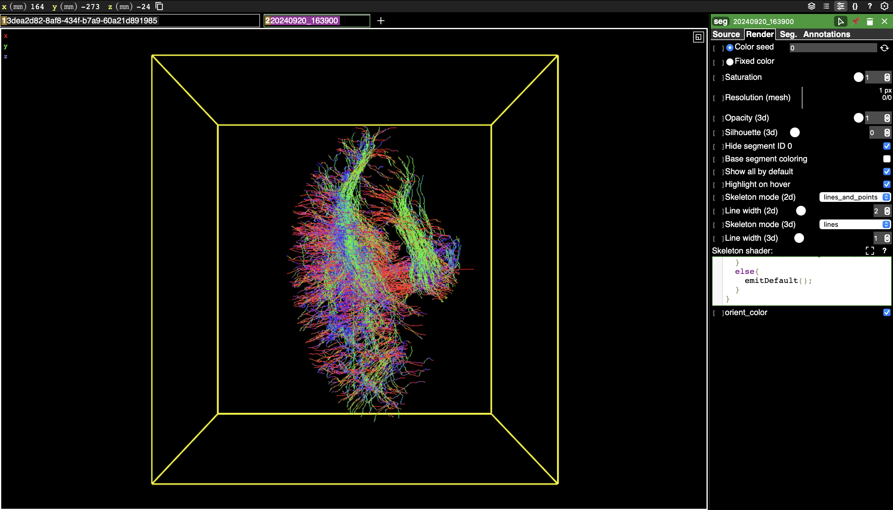

# Neuroglancer-Tractography (.trk file reader in TypeScript)

This project is used to:
- Read .trk data using TypeScript.
- Convert .trk files to streamline data in the form of skeletons.
- Visualize the data in Neuroglancer.

## Video Demo

## Graphics

